# Multilingual Correlation Status

## Current State

The first multilingual correlation slice is live in the trading floor runtime.

What works now:

- Signals preserve:
  - `original_text`
  - `original_language`
  - `translated`
  - `translation_provider`
  - `translation_confidence`
  - `narrative_cluster_id`
  - `corroborating_languages`
- English and non-English signals can be grouped into the same narrative cluster.
- Multilingual corroboration feeds into evidence scoring.
- Scanner and research prompts now see language and translation quality metadata.
- Neo4j persists:
  - original language
  - translated-to-English relationship
  - narrative cluster membership
  - multilingual entity aliases

What does not work yet:

- There is not yet a real external translation provider wired in.
- The runtime currently uses:
  - `identity`
  - `source_payload`
  - `pass_through`
- There is not yet a full native-source global feed pack running.
- Region is not yet a first-class routing primitive in the live decision path.
- Lead-time scoring and narrative-divergence detection are not yet implemented.

## Languages

The runtime shape supports arbitrary language codes through `Signal.Languages`.

Explicitly exercised in code/tests now:

- `en`
- `ar`
- `zh`
- `fr`

Current behavior by language:

- `en`
  - identity translation path
  - full prompt visibility
- non-English with source-supplied translation
  - original text preserved
  - translated English text used for clustering/reasoning
  - translation provider and confidence persisted
- non-English without translation
  - pass-through fallback
  - lower translation confidence

## Regions

There is not yet a complete region layer, but the system is most ready for:

- MENA / Gulf
  - Arabic Telegram / RSS
- China / East Asia
  - Chinese feeds
- Europe
  - French and English sources

This is readiness, not full region-native routing.

What still needs to happen for real regional intelligence:

- `Region` nodes must become active in routing logic
- source-to-region mapping must be broadened
- event lead-time must be learned per source/language/region
- narrative divergence must compare state vs local vs market press

## Architecture

```mermaid
flowchart LR
    A[Native Source Feed\\nEnglish Arabic Chinese etc.] --> B[Normalize + Sanitize]
    B --> C[Translation Layer\\nidentity source-payload pass-through]
    C --> D[Entity Resolution\\nmultilingual aliases]
    D --> E[Clusterer\\nstory similarity]
    E --> F[Narrative Correlator\\ncross-language event grouping]
    F --> G[Cross-Reference\\nsources entities languages owner groups]
    G --> H[Evidence Scoring\\ntrust freshness contradiction confidence vector]
    H --> I[Scanner]
    I --> J[Research]
    J --> K[Neo4j\\nSignal Language Narrative graph]
```

## What This Actually Means

The system is no longer English-only in structure.

It can now:

- retain native-language source text
- correlate that text with English or other translated reports
- represent multilingual corroboration explicitly
- let downstream reasoning see whether the signal is translated, how, and with what confidence

It cannot yet claim a true multilingual edge, because the two highest-value layers are still missing:

- real translation infrastructure
- broad native-language source coverage

## Next Build Steps

1. Wire an external translation provider.
2. Add native-language RSS and Telegram source packs.
3. Add lead-time scoring per source/language/event type.
4. Add narrative divergence detection.
5. Promote region to a first-class routing primitive.

## Short Answer

- Does it work? Yes.
- Is it production-complete multilingual intelligence? No.
- Is the architecture now ready for that next step? Yes.
