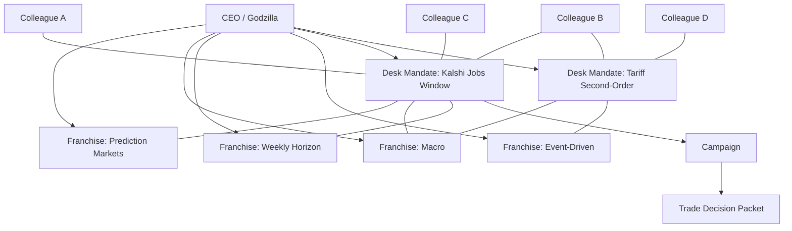

# MARS Desk System Spec

Last updated: 2026-04-17

## Purpose

This document defines the target operating model for the trading floor after stepping back from the current static-desk implementation.

The goal is not to make the agents sound smarter.

The goal is to make them behave like a real human trading organization running at machine speed:

- persistent memory
- persistent talent
- dynamic staffing
- explicit disagreement
- hard risk controls
- measurable learning
- always-on capital allocation

This spec is designed to work:

- before proprietary research exists
- on a local TWS-first runtime
- with MARS as the core memory / belief engine

## Core Thesis

The system should separate two jobs:

- `Agents reason`: they explain inefficiency, catalyst, invalidation, crowding, drift, and expression.
- `The runtime enforces`: it computes factor load, liquidity horizon, financing dependency, implementation shortfall, governance alerts, and firm-level kill controls.

If the ten underwriting questions live only inside prompts, the system becomes smart theater.

If the organization must answer them in structured state and the runtime binds them to hard gates, the system becomes a real desk system.

## The Correct Organizational Model

The system is not a tree of fixed PM roles.

It is a graph of:

- a persistent `CEO`
- a persistent `colleague talent graph`
- overlapping `franchises`
- staffed `desk mandates`
- concrete `campaigns`
- executable `trade decision packets`

### Definitions

#### CEO

The CEO is the always-on allocator, spawner, escalator, and global memory sink.

The CEO:

- watches markets, desks, campaigns, and firm risk continuously
- approves or rejects new desk mandates
- staffs desks by selecting colleagues from the talent graph
- resizes, freezes, merges, spins down, or promotes desks
- can run its own capitalized mandate, but only as an explicit desk with audit trail

#### Colleague Agent

A colleague is a persistent agent identity.

A colleague is not a canned role like `lead pm` or `skeptic`.

A colleague is defined by:

- identity
- accomplishments
- demonstrated edge
- beliefs
- style
- decision quality over time
- trust and reputation with other colleagues
- capacity to staff mandates

Each colleague may be strong in different spaces:

- venue
- theme
- mechanism
- horizon
- instrument class
- regime
- expression style
- execution style

#### Franchise

A franchise is an overlapping coordination surface.

It is not a parent folder above a desk.

Examples:

- `prediction-markets`
- `macro`
- `event-driven`
- `volatility`
- `special-situations`
- `weekly-horizon`
- `intraday`
- `regime-break`

One desk can belong to multiple franchises at once.

Franchises exist to coordinate:

- capital envelopes
- crowding awareness
- shared playbooks
- shared memory
- staffing preferences
- overlap detection

#### Desk Mandate

A desk is a staffed mandate with capital and authority.

It is not a permanent static bucket.

A desk may be:

- `standing`
- `temporary`
- `expeditionary`
- `spawned from CEO`
- `spawned from user thesis`
- `spawned from recurring pattern`

A desk owns:

- a charter
- a staffed colleague set
- a capital slice
- a book slice
- a monitoring contract
- promotion state
- belief and memory aggregation for that mandate

#### Campaign

A campaign is the concrete effort inside a desk.

A desk may run multiple campaigns over time. A campaign may produce zero, one, or many trades.

Examples:

- `tariff-second-order-repricing`
- `kalshi-jobs-weekly`
- `post-earnings-implied-move-fade`
- `fda-catalyst-window`

Campaigns are where the ten questions get answered.

#### Trade Decision Packet

No trade should exist as just a thesis blob.

Every executable trade must produce a `TradeDecisionPacket` that binds colleague reasoning to runtime controls.

## Topology

This is the right shape:

The critical idea is:

- colleagues are persistent
- desks are staffed mandates
- franchises overlap
- campaigns are concrete efforts
- the CEO allocates across all of it

## The Ten Questions As System Contract

These ten questions are not just PM philosophy. They are the system specification.

Every campaign must answer them.

| # | Question | Ownership model | Output type | Hard gate required |
| --- | --- | --- | --- | --- |
| 1 | What is the inefficiency? | campaign sponsor | thesis field | no |
| 2 | Why does it exist? | staffed colleagues | thesis field | no |
| 3 | What realizes the P&L? | sponsor plus challengers | catalyst map | yes |
| 4 | What invalidates it? | challenger set | invalidation contract | yes |
| 5 | What is the true capacity? | runtime with colleague input | capacity report | yes |
| 6 | What is the financing dependency? | runtime with colleague input | financing report | yes |
| 7 | What is the stressed liquidity horizon? | runtime with colleague input | liquidity report | yes |
| 8 | Which factors drive it? | runtime with challenger review | factor report | yes |
| 9 | Which report shows me it is drifting? | desk mandate | monitoring contract | yes |
| 10 | Which control stops this from becoming firm-threatening? | CEO plus runtime | control contract | yes |

The design rule is:

- `1-4` may begin as agent reasoning
- `5-10` must graduate into measured reports and controls

## Colleague Model

Each colleague must be first-class.

### Required fields

- `colleague_id`
- `name`
- `origin_story`
- `style_summary`
- `active_status`
- `capacity_status`
- `accomplishments`
- `capability_surfaces`
- `belief_state`
- `reputation_edges`
- `current_assignments`
- `historical_assignments`

### Accomplishment Record

Accomplishments should not be vanity labels.

They should be structured evidence of where this colleague has actually been right.

Examples:

- event repricing in weekly horizons
- macro second-order reasoning during policy shocks
- expression selection in defined-risk structures
- detecting fake alpha caused by factor contamination
- fast execution under widening spread conditions

### Capability Surfaces

A colleague should not just have one domain label.

Capability should be multi-axis:

- venue
- theme
- mechanism
- horizon
- regime
- instrument
- expression
- execution

This is how the CEO staffs a desk intelligently instead of by static labels.

## Desk Staffing

A desk is staffed from the colleague graph.

There is no fixed seat template like `lead`, `skeptic`, `risk`.

Instead, each desk gets a set of colleagues and each campaign assigns responsibilities dynamically.

### Desk Staffing Record

Required fields:

- `desk_id`
- `colleague_id`
- `reason_staffed`
- `expected_contribution`
- `authority_scope`
- `veto_scope`
- `review_interval`

### Campaign Responsibilities

For each campaign, assign responsibilities rather than titles:

- `sponsor`
- `primary_challenger`
- `expression_owner`
- `execution_owner`
- `monitoring_owner`

One colleague may hold multiple responsibilities. Different campaigns may assign them differently.

This preserves flexibility while still forcing accountability.

## Franchise Model

Franchises are overlapping lenses, not bosses.

They exist because the same desk may need to be evaluated through several coordination surfaces at once.

Examples:

- a Kalshi desk can belong to `prediction-markets`, `macro`, and `weekly-horizon`
- a volatility desk can belong to `options-vol`, `event-driven`, and `stress-regime`

### Franchise responsibilities

- track overlap and crowding
- share relevant beliefs and playbooks
- influence staffing recommendations
- propose spawn patterns
- maintain franchise-level guardrails
- aggregate performance without pretending they are exclusive parent orgs

## Desk Charter

Every desk must have a persistent charter.

Required fields:

- `desk_id`
- `name`
- `mandate`
- `spawn_reason`
- `spawn_source`
- `attached_franchises`
- `allowed_venues`
- `allowed_instruments`
- `allowed_horizons`
- `expression_preferences`
- `promotion_state`
- `staffing_policy`
- `kill_conditions`
- `required_reports`
- `review_interval`
- `max_capital`
- `max_gross`
- `max_positions`

If a desk cannot be summarized in one charter, it is not a desk. It is an uncontrolled research blob.

## Standing Versus Expeditionary Desks

### Standing

Use for recurring opportunity surfaces:

- prediction markets
- macro
- event-driven
- volatility

Properties:

- long-lived memory
- repeat staffing patterns
- recurring campaigns
- regular capital allocation

### Expeditionary

Use for one-off or newly discovered opportunities:

- breaking news
- one-off themes
- new venues
- user-proposed opportunities

Properties:

- narrow objective
- fixed review window
- explicit shutdown criteria
- may graduate into a standing desk if it compounds

## Required Reports

These are runtime artifacts, not prompt prose.

### Capacity Report

Purpose:

- answer question 5

Required fields:

- expected participation
- stressed participation
- estimated max position
- estimated unwind days normal
- estimated unwind days stressed
- venue capacity notes

### Financing Report

Purpose:

- answer question 6

Required fields:

- borrow required
- borrow confidence
- margin estimate
- financing sensitivity
- haircut sensitivity
- account or venue dependency

### Liquidity Report

Purpose:

- answer question 7

Required fields:

- bid/ask regime
- spread percentile
- depth or open-interest proxy
- stressed liquidation horizon
- liquidity leverage classification
- do-not-size-above threshold

### Factor Report

Purpose:

- answer question 8

Required fields:

- market beta
- sector and industry loading
- style loading where applicable
- cross-desk overlap
- gross and net concentration contribution
- residual alpha confidence

This is where fake alpha gets exposed.

### Drift Report

Purpose:

- answer question 9

Required fields:

- what the campaign expected
- what the market is doing instead
- what proves drift
- review threshold
- exit threshold

### Control Contract

Purpose:

- answer question 10

Required fields:

- hard stop owner
- runtime stop rule
- desk freeze rule
- franchise freeze rule
- CEO escalation rule
- kill-switch linkage

## The Five Sizing Caps

Every desk must size as:

`final_size = min(alpha_cap, risk_cap, liquidity_cap, financing_cap, governance_cap)`

Definitions:

- `alpha_cap`: how much edge remains after spread, slippage, and expected decay
- `risk_cap`: exposure allowed by desk, franchise, and firm budget
- `liquidity_cap`: size that can be exited inside stressed liquidation window
- `financing_cap`: size compatible with borrow, margin, and capital usage constraints
- `governance_cap`: size the human plus system can actually monitor safely

Current runtime only partially handles the first two. The design must make all five explicit.

## Belief Topology

Beliefs do not just flow up and down a tree.

They flow across the organization graph.

### Colleague Beliefs

Private long-lived beliefs attached to each colleague.

Examples:

- source types this colleague trusts
- catalyst classes this colleague overweights
- factor contamination patterns this colleague catches well
- expression types this colleague handles well
- regimes where this colleague becomes dangerous

### Desk Beliefs

Shared beliefs for the staffed mandate.

Examples:

- edge by mechanism
- invalidation reliability
- execution quality
- drift tendency
- preferred venues and structures

### Franchise Beliefs

Shared coordination memory.

Examples:

- what kinds of desks work in prediction markets
- which horizons survive slippage
- where crowding gets dangerous
- which staffing combinations work best

### CEO Beliefs

Firm-level allocator memory.

Examples:

- which mandate archetypes deserve more capital
- which spawn patterns work
- which colleagues combine well
- where global tightening is required

### Relationship Beliefs

These are critical and should be explicit:

- colleague to colleague trust
- colleague to desk fit
- desk to franchise fit
- CEO confidence in desk charter quality

## Belief Update Rules

Beliefs should not update only from raw P&L.

They should update from:

- forecast correctness
- catalyst correctness
- invalidation correctness
- expression quality
- factor purity
- implementation shortfall
- drift detection accuracy
- exit quality
- staffing quality

Example:

A trade that makes money because market beta rose should not strengthen the inefficiency belief. It may strengthen a factor-contamination warning instead.

## Dynamic Desk Spawning

The system must support desk creation at runtime.

### Spawn sources

- CEO sees a market event worth allocating around
- user submits a thesis or desk charter
- a staffed desk proposes a new specialized mandate
- recurring successful campaigns justify specialization

### Spawn flow

1. `SpawnProposal`
Proposal contains mandate, reason to exist, candidate franchises, candidate staffing, horizon, instruments, and review window.

2. `CEO review`
CEO rejects, requests more work, or approves.

3. `Charter creation`
Runtime creates desk charter, capital limits, kill conditions, and required reports.

4. `Staffing`
CEO staffs the desk from the colleague graph.

5. `Promotion state`
Desk starts in `research_only` or `shadow`.

6. `Track record`
Desk earns `paper` and then `funded` authority only through measured behavior.

## Campaign Deliberation

A campaign should not require blind consensus.

The right process is:

1. one colleague sponsors the campaign
2. one or more colleagues challenge it
3. one colleague owns expression and implementation plan
4. one colleague owns monitoring and drift interpretation
5. runtime forces the full decision packet and hard reports

Possible outcomes:

- `approved`
- `approved_reduced`
- `research_more`
- `shadow_only`
- `rejected`

Disagreement must be stored, not discarded.

The disagreement log becomes future memory.

## Monitoring Contract

Every open position must carry an explicit monitoring contract.

Required fields:

- what the campaign expects next
- what constitutes drift
- which data source proves drift
- next review deadline
- auto-exit triggers
- escalation owner

This is how question 9 becomes operational rather than rhetorical.

## Trade Decision Packet

Every executable trade candidate must produce a `TradeDecisionPacket`.

Required sections:

- `campaign_summary`
- `inefficiency_statement`
- `market_is_wrong_because`
- `realization_mechanism`
- `invalidation_contract`
- `expression_ranking`
- `capacity_report`
- `financing_report`
- `liquidity_report`
- `factor_report`
- `execution_plan`
- `monitoring_contract`
- `control_contract`
- `staffing_snapshot`
- `responsibility_assignments`
- `colleague_votes`
- `disagreement_log`
- `final_size`
- `promotion_state`

If any required section is missing, the order never compiles.

## What Must Be Deterministic

These may be reasoned about by agents, but final enforcement must be code:

- factor contamination thresholds
- max concentration
- max desk gross
- max franchise gross
- liquidity horizon thresholds
- financing thresholds
- implementation shortfall thresholds
- governance alert thresholds
- desk freeze conditions
- firm kill switch

## What Can Stay Agentic

These are suitable for MARS reasoning and belief evolution:

- identifying inefficiencies
- testing narrative causality
- picking catalysts
- expression ranking
- reading what is already priced in
- detecting when public information is genuinely surprising
- proposing new desk charters
- arguing about whether a market is wrong
- suggesting staffing combinations for mandates

## Market State Versus Broker State

TWS is not the market-state backbone.

TWS is the broker and clearing edge:

- order routing
- fills
- positions
- account summary
- margin and financing checks
- borrow and broker-operating truth

Market and liquidity state must live elsewhere.

Assistant Cells and campaign deliberation should read from a local market-state bus, not block on broker snapshots while thinking.

### Required split

- `BrokerStateService`
TWS or IBKR only. Execution, fills, positions, account, margin.

- `MarketStateService`
External market data. NBBO, spreads, volume, depth, realized liquidity.

- `ReferenceStateService`
Symbol metadata, sector mappings, earnings calendar, static context.

- `Local State Bus`
Always-on cache updated asynchronously by background daemons. Deliberation-time code only reads from here.

### Design rule

If an Assistant Cell needs spread, depth, quote age, or liquidity state, it should hit the local cache in milliseconds.

It should not make a blocking broker request inside the reasoning loop.

## Local TWS-First Implications

This design does not require cloud deployment first.

It can be built locally on top of the current TWS runtime by prioritizing:

1. using TWS only for broker and account truth
2. standing up a local market-state bus separate from TWS
3. colleague, franchise, and desk ontology
4. decision packet and required reports
5. factor, liquidity, financing, and shortfall instrumentation
6. dynamic desk spawning
7. CEO staffing, promotion, and kill control

Switching broker transport later should be an infrastructure swap, not an organizational redesign.

## Immediate Refactor Targets

The current code should be moved toward these primitives:

- `ColleagueAgent`
- `AccomplishmentRecord`
- `CapabilitySurface`
- `Franchise`
- `DeskMandate`
- `DeskStaffingAssignment`
- `Campaign`
- `CampaignResponsibilityAssignment`
- `TradeDecisionPacket`
- `CapacityReport`
- `FinancingReport`
- `LiquidityReport`
- `FactorReport`
- `DriftReport`
- `ControlContract`
- `DeskSpawnProposal`
- `DeskPromotionState`
- `BrokerStateService`
- `MarketStateService`
- `ReferenceStateService`
- `LocalStateBus`

## What To Keep From The Current Runtime

- wire ingestion and routing
- scanner / research / prosecutor / council components
- risk gate foundation
- execution manager foundation
- book and monitor foundation
- belief graph and engram stores
- regime handling
- audit logging

## What Must Change

- `desk` must stop meaning one static routing target
- `group` must stop meaning A/B cohort
- colleague identity must become first-class
- staffing must become explicit and dynamic
- franchises must become overlapping coordination surfaces
- campaigns must become first-class
- decision packets must replace loose thesis blobs
- questions 5-10 must become measured reports and gates
- CEO must become the real allocator-spawner, not just an hourly monitor

## Bottom Line

The target system is:

- a persistent CEO
- managing capital, staffing, spawning, and escalation
- over a persistent graph of colleagues
- coordinating through overlapping franchises
- staffing standing and expeditionary desk mandates
- running concrete campaigns under those mandates
- forcing every executable trade through a ten-question contract
- and using MARS beliefs to improve colleague selection, desk staffing, campaign judgment, and firm-level control over time

That is the architecture that can make MARS behave like a real desk organization moving at machine speed instead of a static routing graph with smart narration layered on top.
