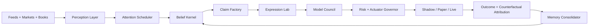

# Persistent Cognitive Trading System Spec

Last updated: 2026-05-25

## Purpose

This document defines the next architecture layer above the current trading floor.

The goal is not to make a larger prompt or let one model trade more freely.

The goal is to build a persistent cognitive market system:

- continuously observing markets and event streams
- maintaining durable beliefs
- detecting tension between internal beliefs and market prices
- inventing tradable claims and expressions
- acting only through governed execution channels
- learning from accepted trades, rejected trades, and counterfactual expressions
- running indefinitely through resumable state, not one long LLM session

In this design, LLMs are not the agent.

LLMs are callable cognitive functions inside a durable belief architecture.

## Core Thesis

The system should become a machine for finding and monetizing belief tension.

```text
alpha = information edge
      + interpretation edge
      + expression edge
      + execution edge
      + portfolio construction edge
      + learning speed
      - transaction costs
      - false confidence
```

The current runtime already has many of the required pieces:

- feed ingestion
- routing
- scanner
- research
- prosecutor
- council
- market context
- Kalshi execution
- IBKR execution
- risk gate
- shadow book
- anti-portfolio
- belief graph
- engrams
- source reliability learning
- regime-conditioned autonomy
- factor crowding

The missing layer is the cognitive kernel that turns those pieces into an always-on belief organism.

## Non-Goals

This system is not:

- a chatbot trader
- an unbounded autonomous money manager
- a single forever prompt
- a guarantee of alpha
- an attempt to create legal financial instruments or operate an exchange

The system may invent internal synthetic claims and paper-only instruments, but executable orders must map to real venues through existing governed actuators.

## Operating Model

The system has four separable jobs.

1. Perceive reality.
2. Maintain beliefs.
3. Search for expression.
4. Act through controlled execution.



The durable agent is the state transition system from `B` through `K`.

LLMs sit behind `Claim Factory`, `Expression Lab`, `Model Council`, summarization, translation, critique, and compilation.

## Human-Like Properties

"Human" here means operational continuity, not sentience.

The system should have:

- identity: stable objectives, constraints, and operating policy
- attention: ability to prioritize interrupts and ignore noise
- working memory: current market session and active tensions
- episodic memory: specific events, decisions, trades, and rejected candidates
- semantic memory: learned relationships among sources, entities, regimes, and instruments
- procedural memory: playbooks and expression patterns that work
- autobiographical memory: what the system has been good and bad at over time
- sleep: after-hours replay, compression, and belief recalibration
- fear: drawdown, uncertainty, and risk saturation reduce action authority
- curiosity: small budget allocated to high-learning-value paper experiments

## Existing Runtime Boundary

The current end-to-end path remains valid:

```text
signal -> scanner -> research -> prosecutor -> council -> risk -> execution/shadow -> learn
```

The new cognitive layer does not replace it.

It wraps and expands it:

```text
signal/event/market_state
  -> attention item
  -> belief update
  -> claim candidate
  -> expression tournament
  -> trade decision packet
  -> existing desk/risk/execution machinery
```

The current desk flow can continue to trade simple direct theses while the cognitive layer matures in shadow/paper.

## Package Plan

Add these packages:

```text
internal/cognition
internal/claims
internal/expressionlab
internal/modelcouncil
internal/memoryos
```

### `internal/cognition`

Owns the long-running cognitive kernel.

Responsibilities:

- event loop
- attention scheduling
- leases and resumable runs
- daily/overnight cycles
- coordination across claim factory, expression lab, and actuators

Key types:

```go
type Kernel struct {
    Attention AttentionQueue
    Beliefs BeliefStore
    Claims ClaimFactory
    Expressions ExpressionLab
    Council ModelCouncil
    Actuators ActuatorGovernor
    Memory MemoryConsolidator
}

type CognitiveEvent struct {
    ID string
    Kind string
    Source string
    Payload json.RawMessage
    ObservedAt time.Time
    Priority float64
}

type CognitiveRun struct {
    ID string
    TriggerEventID string
    Stage string
    Status string
    LeaseUntil time.Time
    StartedAt time.Time
    UpdatedAt time.Time
}
```

### `internal/claims`

Turns observations and belief tension into structured tradable claims.

Responsibilities:

- map events into propositions
- compute current market-implied beliefs
- create claim candidates
- track claim decay and invalidation
- avoid duplicate claims

Key type:

```go
type Claim struct {
    ID string
    Kind string
    Statement string
    Horizon time.Duration
    Credence float64
    Confidence float64
    DecayHalfLife time.Duration
    Regime string
    EvidenceIDs []string
    EntityIDs []string
    MarketImplied map[string]float64
    Contradictions []string
    CreatedAt time.Time
    ExpiresAt time.Time
}
```

Examples:

```text
fed_cut_underpriced
oil_sanction_probability_stale
earnings_guidance_revision_lag
foreign_language_policy_shock
vol_underreaction_to_event
second_order_supplier_repricing
kalshi_equity_probability_divergence
```

### `internal/expressionlab`

Searches for the best way to express a claim.

Responsibilities:

- generate candidate expressions
- parse expression DSL
- simulate payoff surfaces
- score expression purity, liquidity, margin, spread cost, convexity, and confounders
- route candidates to shadow, paper, or live eligibility
- store counterfactual candidates

Key types:

```go
type ExpressionCandidate struct {
    ID string
    ClaimID string
    DSL string
    Structure string
    Instruments []model.Instrument
    Legs []model.TradeLeg
    Direction model.TradeDirection
    Horizon time.Duration
    Score ExpressionScore
    Eligibility string // shadow, paper, live_candidate, rejected
    RejectionReason string
}

type ExpressionScore struct {
    Total float64
    Purity float64
    Convexity float64
    Liquidity float64
    SpreadCost float64
    MarginEfficiency float64
    TailRisk float64
    ConfounderPenalty float64
    Learnability float64
}
```

Initial DSL:

```text
LONG symbol=TLT qty=10
SHORT symbol=KRE qty=10
CALL_SPREAD symbol=NVDA expiry=20260619 long=130 short=145 qty=1 debit<=4.20
PUT_SPREAD symbol=TLT expiry=20260717 long=88 short=82 qty=1 debit<=1.15
KALSHI_YES ticker=KXFEDCUT-26 max_price=0.42 contracts=10
KALSHI_NO ticker=KXFEDCUT-26 max_price=0.58 contracts=10
PAIR long=XLU short=SPY beta_neutral=true gross=5000
BASKET_LONG names=[MSFT:0.30,AMZN:0.30,GOOGL:0.40] gross=10000
SHADOW_SYNTHETIC claim=oil_sanction_probability_stale payoff=binary threshold=0.60
```

The DSL compiler must be deterministic.

LLMs may propose DSL.

Only Go code validates and compiles DSL into `model.Thesis`, `model.Order`, or shadow-only candidates.

### `internal/modelcouncil`

Uses model diversity as a cognitive asset.

Responsibilities:

- assign models to roles
- request independent judgments
- measure model calibration by task class
- store model votes and rationales
- prevent one model from dominating the belief graph

Roles:

```text
scout: cheap broad candidate generation
translator: cross-language/source cleanup
inventor: unusual claim/expression generation
historian: analogue search
microstructure: liquidity/spread critique
risk: tail/confounder critique
skeptic: adversarial rejection
compiler: structured output repair
judge: final ranking
```

Model choice should be dynamic.

OpenRouter makes this feasible because the catalog includes many long-context, structured-output, tool-capable, cheap, free, multimodal, and frontier models. The system should treat the model catalog as a resource pool, not a hard-coded provider choice.

Key types:

```go
type ModelRole string

type ModelVote struct {
    ID string
    RunID string
    Model string
    Role ModelRole
    TargetType string // claim, expression, thesis, rejection
    TargetID string
    Vote float64
    Confidence float64
    Rationale string
    TokensIn int
    TokensOut int
    CostUSD float64
    CreatedAt time.Time
}
```

### `internal/memoryos`

Runs consolidation and recall.

Responsibilities:

- compress episodes into summaries
- update semantic memory
- promote/demote playbooks
- create morning watchlist
- create after-action reports
- replay anti-portfolio and expression counterfactuals

Memory layers:

```text
working: active market session
episodic: events, decisions, outcomes
semantic: entities, relationships, recurring mechanisms
procedural: playbooks, expression recipes
belief: credences and confidence
counterfactual: rejects and untraded expressions
self: capability, model, desk, source calibration
```

## Belief Model

Beliefs should be first-class records, not implicit prompt text.

```go
type Belief struct {
    ID string
    Subject string
    Predicate string
    Object string
    Statement string
    Credence float64
    Confidence float64
    Volatility float64
    Regime string
    SourceCount int
    ContradictionCount int
    LastEvidenceAt time.Time
    DecayHalfLife time.Duration
    CreatedAt time.Time
    UpdatedAt time.Time
}
```

Credence means "how true the proposition seems."

Confidence means "how much weight the system should put on that credence."

Example:

```text
statement: "June Fed cut is underpriced"
credence: 0.68
confidence: 0.54
market_implied.kalshi: 0.47
market_implied.rates_proxy: 0.52
regime: medium:neutral:neutral:normal
```

## Belief Tension

Belief tension is the primary attention primitive.

```text
tension = abs(internal_credence - market_implied)
        * confidence
        * source_reliability
        * lead_time_score
        * novelty
        * liquidity_weight
        * decay_urgency
        - contradiction_penalty
        - crowding_penalty
```

If tension is high, the system should create or update a claim.

Examples:

- internal probability of Kalshi event is 0.68, market trades 0.47
- source says supply risk is rising, options skew unchanged
- foreign-language source historically leads US coverage by three hours
- equity has moved but related event market has not
- event market moved but sector basket did not

## Claim Factory

Claim creation pipeline:

```text
attention_item
  -> extract entities/events
  -> retrieve related beliefs
  -> compute market-implied prices
  -> detect tension
  -> ask model swarm for claim candidates
  -> canonicalize claim
  -> dedupe against active claims
  -> assign horizon/decay/invalidation
```

Claim requirements:

- explicit proposition
- measurable horizon
- invalidation condition
- evidence set
- market-implied comparison when available
- tradable consequence
- confidence separate from credence

Bad claim:

```text
"NVIDIA looks strong"
```

Good claim:

```text
"After the export-control headline, the market underprices a 5-10 trading day reduction in China-exposed GPU revenue expectations relative to current NVDA options skew and SOXX reaction."
```

## Expression Lab

For each active claim, run an expression tournament.

```text
claim
  -> generate 20-200 candidates
  -> compile DSL
  -> hydrate market context
  -> simulate payoff
  -> estimate transaction cost
  -> estimate hidden exposures
  -> score and rank
  -> route top candidates to shadow/paper/live eligibility
```

Candidate families:

- direct equity
- ETF proxy
- pair trade
- basket
- option vertical
- option calendar
- option straddle/strangle
- event contract
- event contract hedge
- synthetic shadow claim

MVP supports:

- single equity/ETF
- Kalshi YES/NO
- defined-risk call/put verticals
- paper-only pair/basket/shadow synthetic

Later supports:

- futures
- FX
- calendars
- ratio spreads
- dispersion
- vol-only structures
- delta-hedged expressions

## Counterfactual Book

Every claim should create more expressions than it trades.

The untraded expressions become a counterfactual book.

This answers:

- Was the idea right but the expression wrong?
- Did the risk gate reject profitable ideas?
- Did options outperform stock?
- Did Kalshi outperform equity?
- Did paper-only synthetic claims predict later executable edge?
- Did the model pick the wrong instrument family?

The counterfactual book should mark all expression candidates against market data where possible.

## Action Authority

The cognitive system has no direct trading authority.

It can request actions:

```text
observe
shadow
paper
live_candidate
live_execute
halt
reduce
exit
```

Only deterministic governors can authorize:

- live entry
- size increase
- instrument expansion
- autonomy promotion
- broker/Kalshi submission

Live action requires:

- active claim
- valid expression
- hydrated market context
- risk approval
- capability token
- entry policy allowing entries
- venue-specific execution readiness
- audit trail

## Actuator Governor

Actuators:

- shadow book
- paper IBKR
- live IBKR
- Kalshi dry-run
- Kalshi live
- watchlist
- user alert
- halt/disable entries

The governor must enforce:

- no model-originated raw order
- all orders go through deterministic compiler
- all live entries go through risk gate
- all risk approvals mint capability tokens
- exits bypass entry blocks but not audit
- every rejected action records reason

## Long-Running Runtime

The system must be resilient to process restarts.

Rules:

- every cognitive run has a durable row
- every stage is idempotent
- each active run has a lease
- crash recovery resumes from last completed stage
- model responses are stored and hash-addressed
- side effects require idempotency keys
- execution side effects remain delegated to existing execution manager

Run stages:

```text
queued
attention_scored
beliefs_loaded
beliefs_updated
tension_detected
claims_generated
claims_deduped
expressions_generated
expressions_scored
model_council_reviewed
action_requested
governor_decided
recorded
completed
failed
```

## Daily Rhythm

### Market Open Loop

Runs continuously.

```text
ingest event
score attention
update beliefs
detect tension
run claim/expression path if above threshold
route to shadow/paper/live candidate
monitor active claims and positions
interrupt on invalidation or risk state change
```

### Intraday Heartbeat

Every 1-5 minutes:

- refresh active claim market-implied prices
- update expression marks
- detect thesis invalidation
- check Kalshi/equity divergence
- check stale quotes
- update attention priorities

### After Close

- mark positions and expressions
- process outcomes where resolved
- update source lead time
- update model/task calibration
- update expression family performance
- generate anti-portfolio report

### Overnight Sleep

- compress memory
- promote/demote playbooks
- summarize regime changes
- build next-day watchlist
- discover recurring tensions
- produce "changed my mind" report

## Database Additions

Initial migration should add:

```sql
CREATE TABLE cognitive_events (
    id TEXT PRIMARY KEY,
    kind TEXT NOT NULL,
    source TEXT,
    payload JSONB NOT NULL,
    observed_at TIMESTAMPTZ NOT NULL DEFAULT NOW(),
    priority FLOAT DEFAULT 0,
    processed_at TIMESTAMPTZ
);

CREATE TABLE cognitive_runs (
    id TEXT PRIMARY KEY,
    trigger_event_id TEXT REFERENCES cognitive_events(id),
    stage TEXT NOT NULL,
    status TEXT NOT NULL,
    lease_until TIMESTAMPTZ,
    error TEXT,
    started_at TIMESTAMPTZ NOT NULL DEFAULT NOW(),
    updated_at TIMESTAMPTZ NOT NULL DEFAULT NOW()
);

CREATE TABLE beliefs (
    id TEXT PRIMARY KEY,
    subject TEXT NOT NULL,
    predicate TEXT NOT NULL,
    object TEXT,
    statement TEXT NOT NULL,
    credence FLOAT NOT NULL,
    confidence FLOAT NOT NULL,
    volatility FLOAT DEFAULT 0,
    regime TEXT,
    source_count INTEGER DEFAULT 0,
    contradiction_count INTEGER DEFAULT 0,
    last_evidence_at TIMESTAMPTZ,
    decay_half_life_seconds BIGINT,
    created_at TIMESTAMPTZ NOT NULL DEFAULT NOW(),
    updated_at TIMESTAMPTZ NOT NULL DEFAULT NOW()
);

CREATE TABLE belief_evidence (
    id TEXT PRIMARY KEY,
    belief_id TEXT NOT NULL REFERENCES beliefs(id),
    signal_id TEXT,
    source TEXT,
    evidence_kind TEXT NOT NULL,
    direction FLOAT NOT NULL,
    weight FLOAT NOT NULL,
    payload JSONB,
    created_at TIMESTAMPTZ NOT NULL DEFAULT NOW()
);

CREATE TABLE claim_candidates (
    id TEXT PRIMARY KEY,
    belief_id TEXT REFERENCES beliefs(id),
    statement TEXT NOT NULL,
    kind TEXT NOT NULL,
    horizon_seconds BIGINT,
    credence FLOAT NOT NULL,
    confidence FLOAT NOT NULL,
    tension_score FLOAT NOT NULL,
    regime TEXT,
    status TEXT NOT NULL,
    invalidation JSONB,
    market_implied JSONB,
    created_at TIMESTAMPTZ NOT NULL DEFAULT NOW(),
    expires_at TIMESTAMPTZ
);

CREATE TABLE expression_candidates (
    id TEXT PRIMARY KEY,
    claim_id TEXT NOT NULL REFERENCES claim_candidates(id),
    dsl TEXT NOT NULL,
    structure TEXT,
    instruments JSONB,
    legs JSONB,
    score JSONB,
    eligibility TEXT NOT NULL,
    rejection_reason TEXT,
    selected BOOLEAN NOT NULL DEFAULT FALSE,
    created_at TIMESTAMPTZ NOT NULL DEFAULT NOW()
);

CREATE TABLE model_votes (
    id TEXT PRIMARY KEY,
    run_id TEXT REFERENCES cognitive_runs(id),
    model TEXT NOT NULL,
    role TEXT NOT NULL,
    target_type TEXT NOT NULL,
    target_id TEXT NOT NULL,
    vote FLOAT,
    confidence FLOAT,
    rationale TEXT,
    tokens_in INTEGER DEFAULT 0,
    tokens_out INTEGER DEFAULT 0,
    cost_usd FLOAT DEFAULT 0,
    created_at TIMESTAMPTZ NOT NULL DEFAULT NOW()
);

CREATE TABLE memory_consolidations (
    id TEXT PRIMARY KEY,
    kind TEXT NOT NULL,
    scope TEXT NOT NULL,
    summary TEXT NOT NULL,
    source_ids JSONB,
    created_at TIMESTAMPTZ NOT NULL DEFAULT NOW()
);
```

## Store Interfaces

Add store files:

```text
internal/store/cognitive_events.go
internal/store/cognitive_runs.go
internal/store/beliefs.go
internal/store/claims.go
internal/store/expressions.go
internal/store/model_votes.go
internal/store/memory_consolidations.go
```

Minimum interfaces:

```go
type CognitiveStore interface {
    EnqueueEvent(ctx context.Context, event *cognition.CognitiveEvent) error
    ClaimRunLease(ctx context.Context, now time.Time) (*cognition.CognitiveRun, error)
    AdvanceRun(ctx context.Context, runID, stage, status string) error
}

type BeliefStore interface {
    UpsertBelief(ctx context.Context, belief *claims.Belief) error
    AttachEvidence(ctx context.Context, evidence *claims.BeliefEvidence) error
    FindRelatedBeliefs(ctx context.Context, event cognition.CognitiveEvent) ([]*claims.Belief, error)
}

type ClaimStore interface {
    UpsertClaim(ctx context.Context, claim *claims.Claim) error
    ActiveClaims(ctx context.Context, now time.Time) ([]*claims.Claim, error)
}

type ExpressionStore interface {
    SaveCandidate(ctx context.Context, candidate *expressionlab.ExpressionCandidate) error
    ClaimCandidates(ctx context.Context, claimID string) ([]*expressionlab.ExpressionCandidate, error)
}
```

## Model Ecology

The system should not hard-code "best model."

It should use model roles and learn which model is useful for which task.

Suggested routing:

```text
cheap scout:
  many candidates, low temperature, low cost

long-context historian:
  retrieve prior episodes, compress analogues

inventor:
  high-diversity expression generation

skeptic:
  adversarial critique of claim and expression

structured compiler:
  strict JSON/DSL repair

frontier judge:
  final ranking for high-value candidates
```

Each model call should record:

- role
- model id
- prompt hash
- input/output tokens
- cost
- target id
- vote/confidence
- later attribution score

This lets the system learn:

- which models are good scouts
- which are good judges
- which hallucinate instruments
- which overstate conviction
- which generate profitable but weird expressions

## Alpha Surfaces

The cognitive system should explicitly hunt these.

### Cross-Market Disagreement

Kalshi, equity, options, rates, ETFs, and futures imply different states.

Example:

```text
Kalshi says Fed cut odds rose 14 points.
TLT options did not reprice.
KRE moved only 20% of historical sensitivity.
```

### Source Lead-Time

Some sources lead price or official coverage.

Learn by:

- source
- owner group
- language
- geography
- domain
- regime
- instrument family

### Attention Gap

Find information the market has not yet absorbed:

- local-language policy news
- niche regulatory filings
- supply chain disclosures
- small-cap/sector-specific releases
- event-market order book movement

### Expression Edge

The thesis is common, but the expression is rare or superior.

Example:

```text
Everyone buys the stock.
System buys defined-risk spread, pair, or event contract hedge.
```

### Anti-Portfolio Inversion

Rejected trades outperform accepted trades under a condition.

This means the filter is wrong in that regime.

### Model Disagreement

Cheap models reject, strong models accept, or vice versa.

Disagreement is not noise by default. It is an attention feature.

### Vol/Realized Gap

Event changes expected realized volatility but implied vol/skew does not move enough.

### Second-Order Causal Lag

First-order ticker moves. Suppliers, customers, competitors, or substitute assets lag.

## Promotion Rules

New cognitive outputs start in shadow.

Promotion ladder:

```text
shadow candidate
  -> paper eligible after N valid marks
  -> paper traded after risk-limited approval
  -> live candidate after calibrated paper edge
  -> live tiny after user/system approval
  -> larger live only after regime-specific validated outcomes
```

Minimum promotion metrics:

- positive expected value net of spread/fees
- sufficient observations
- low tail-risk violation rate
- expression compiler success
- no unresolved hidden exposure warnings
- source/model calibration above floor
- regime-specific competence above floor

## Safety Contracts

Hard rules:

- No raw LLM order can reach broker/Kalshi.
- No live entry without risk gate.
- No live entry without capability token.
- No live entry when global entry control is disabled.
- No live entry for unsupported DSL structures.
- No live promotion based only on PnL.
- No promotion without attribution quality.
- Exits must remain available during entry halts.
- Every cognitive action must be replayable from stored state.

## MVP Build

### Phase 1: Cognitive Event Queue

Build:

- `cognitive_events`
- `cognitive_runs`
- `internal/cognition.Kernel`
- event enqueue from wire manager and market heartbeat
- lease/resume loop

Success:

- runtime records events
- kernel processes events idempotently
- restart does not duplicate side effects

### Phase 2: Belief Tension MVP

Build:

- `beliefs`
- `belief_evidence`
- tension scoring
- Kalshi market-implied probability comparison
- source reliability and lead-time inputs

Success:

- system creates belief tension records
- high-tension events are ranked above normal scanner noise
- active tensions are queryable

### Phase 3: Claim Factory

Build:

- `claim_candidates`
- model role: scout
- model role: skeptic
- deterministic claim canonicalizer
- dedupe

Success:

- event creates 1-5 claims
- claims have horizon, invalidation, credence, confidence, and market-implied values
- duplicate headlines update existing claims

### Phase 4: Expression Lab MVP

Build:

- `expression_candidates`
- DSL parser
- support `LONG`, `SHORT`, `CALL_SPREAD`, `PUT_SPREAD`, `KALSHI_YES`, `KALSHI_NO`, `SHADOW_SYNTHETIC`
- expression scoring

Success:

- each claim produces multiple expressions
- invalid DSL is rejected deterministically
- top expression can become a shadow thesis

### Phase 5: Counterfactual Book

Build:

- marking for untraded expression candidates
- expression outcome attribution
- compare selected vs unselected candidates

Success:

- system can answer "what should we have traded instead?"

### Phase 6: Paper Discovery Mode

Build:

- lower action threshold for paper/shadow only
- route more claims to paper candidates
- keep live gates unchanged

Success:

- more samples
- no live risk relaxation
- anti-portfolio and expression candidates accumulate useful outcomes

### Phase 7: Sleep Cycle

Build:

- after-close replay
- memory consolidation
- model/source/expression calibration update
- morning report

Success:

- system starts each day with updated beliefs and watchlist
- changed beliefs are explicitly explained

## First Vertical Slice

The first vertical should focus on Kalshi because event markets provide explicit probabilities.

Use case:

```text
Kalshi event contract moves or fails to move after news.
System compares internal claim credence to Kalshi implied price.
System generates Kalshi YES/NO and equity/ETF shadow expressions.
System routes only Kalshi paper/dry-run or shadow at first.
System tracks whether internal probability or market probability was better.
```

Why Kalshi first:

- direct probability surface
- clear outcome resolution
- smaller expression universe
- strong fit for belief tension
- easier attribution than broad equity moves

Initial alpha pattern:

```text
event_probability_divergence:
  source evidence implies probability P_internal
  Kalshi market implies P_market
  tension = abs(P_internal - P_market)
  expression = buy YES/NO only if spread, price cap, and risk permit
```

## Example End-to-End

Input:

```text
Headline: "Fed governor says labor deterioration could justify earlier cuts."
Kalshi June cut YES trades 0.38/0.40.
Rates ETF TLT unchanged.
Source historically leads rates repricing by 2.1h.
```

Belief:

```text
statement: "June cut probability is underpriced"
credence: 0.57
confidence: 0.48
market_implied.kalshi: 0.40
tension: high
```

Claims:

```text
claim_1: Fed June cut odds should reprice above 0.48 within 24h.
claim_2: duration-sensitive ETFs should catch up if event probability reprices.
```

Expressions:

```text
KALSHI_YES ticker=KXFEDCUT-26 max_price=0.42 contracts=10
LONG symbol=TLT qty=3
CALL_SPREAD symbol=TLT expiry=20260717 long=92 short=97 debit<=1.25
SHADOW_SYNTHETIC claim=fed_cut_underpriced payoff=binary threshold=0.48
```

Governor:

```text
Kalshi paper: allowed
TLT shadow: allowed
TLT live: rejected until expression family has validated outcomes
```

Outcome:

```text
Kalshi closes at 0.51 after 8h.
TLT moves 0.6%.
Call spread mark improves.
Source lead-time score increases.
Kalshi expression recipe gains confidence.
```

## Acceptance Criteria

The system is working when it can answer these without manual reconstruction:

- What does it currently believe?
- Why does it believe that?
- What market prices disagree?
- Which claims are active?
- Which expressions were considered?
- Why was the selected expression chosen?
- Which rejected expressions would have worked better?
- Which source/model/desk/expression got credit or blame?
- What changed overnight?
- What is the system allowed to do today that it was not allowed to do yesterday?
- What authority was reduced due to mistakes?

## Implementation Principle

Keep the current trading floor conservative.

Build the cognitive layer as a shadow brain first.

Then let it earn paper authority.

Then let very narrow expression families earn tiny live authority.

The hard line:

Models may think wildly.

The runtime must act soberly.
