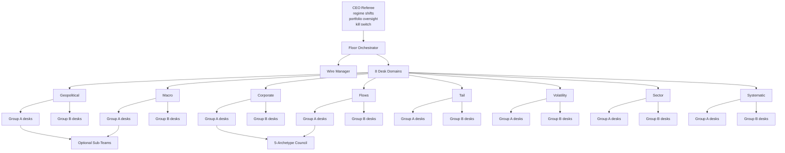
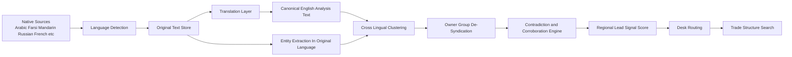

# Trading Floor Architecture Overview

Last updated: 2026-03-15

## Purpose

This document describes where the trading floor is now, what is already live in the runtime, and what the next major intelligence layer should be.

The core thesis is:

- Prediction alone is not the moat.
- The moat is continuous, cross-source, cross-asset, cross-language synthesis plus execution expressiveness.
- AI should not think like one human PM.
- AI should behave like a permanent market organism with memory, self-awareness, debate, and structure selection.

## State Of The System

Current live shape:

- Single Go runtime, launched as a local `launchd` service.
- 8 feed classes registered: `news`, `market`, `edgar`, `social`, `macro`, `telegram`, `earnings`, `alternative`.
- 40 desks across 8 domains.
- Real A/B split: 20 Group A desks with MARS-style autonomy gating, 20 Group B control desks without it.
- End-to-end pipeline is live: signal -> scanner -> research -> prosecutor -> council -> risk -> execution/shadow book -> monitor -> learn.
- Multi-leg execution exists, but only for defined-risk debit verticals right now.
- AiFW-style evidence discipline is now ported into Go: source trust, source tier, freshness, contradiction detection, owner-group corroboration, evidence score.

Current non-goals:

- This is not yet a graph-native world model.
- This is not yet true cross-lingual market intelligence.
- This is not yet full-structure derivatives expressiveness.
- This is not yet a deployed cloud-native service mesh. It is a hardened local trading runtime.

## Runtime Flow

```mermaid
flowchart LR
    A[Feeds\nnews market edgar social macro telegram earnings alt] --> B[Wire Manager]
    B --> C[Normalize]
    C --> D[Dedup]
    D --> E[Cluster]
    E --> F[Cross Reference]
    F --> G[Evidence Gate Inputs\ntrust freshness contradiction owner groups]
    G --> H[Domain Router]
    H --> I[Desk Mesh]
    I --> J[Scanner]
    J --> K[Research]
    K --> L[Prosecutor]
    L --> M[Council]
    M --> N[Risk Gate]
    N --> O[Execution or Shadow Book]
    O --> P[Book and Monitor]
    P --> Q[Learn Worker]
    Q --> R[Belief Graph + Engrams]
    R --> I
```

## Control Hierarchy

## Desk Hierarchy

The floor is organized by domain first, then by desk specialization, then by A/B treatment group.

| Domain | Group A desks | Group B desks | Capital pattern |
| --- | --- | --- | --- |
| Geopolitical | `geo-cascade-a`, `geo-event-a`, `geo-secondorder-a` | `geo-cascade-b`, `geo-event-b` | `25k` each |
| Macro | `macro-rates-a`, `macro-crossasset-a`, `macro-inflation-a` | `macro-rates-b`, `macro-crossasset-b` | `25k` each |
| Corporate | `corp-earnings-a`, `corp-filings-a`, `corp-mna-a` | `corp-earnings-b`, `corp-filings-b` | `25k` each |
| Flows | `flow-options-a`, `flow-contrarian-a`, `flow-squeeze-a` | `flow-options-b`, `flow-contrarian-b` | `25k` each |
| Tail | `tail-geo-a`, `tail-financial-a` | `tail-structure-b`, `tail-geo-b`, `tail-financial-b` | `15k` each |
| Volatility | `vol-premium-a`, `vol-event-a` | `vol-termstructure-b`, `vol-premium-b`, `vol-event-b` | `25k` each |
| Sector | `sector-tech-a`, `sector-biotech-a` | `sector-energy-b`, `sector-tech-b`, `sector-biotech-b` | `25k` each |
| Systematic | `sys-momentum-a`, `sys-meanrev-a` | `sys-statarb-b`, `sys-momentum-b`, `sys-meanrev-b` | `25k` each |

Operational meaning:

- Group A is the treatment arm.
- Group B is the control arm.
- Group A learns, accumulates beliefs, earns autonomy, gets regime-specific competence, and uses engrams.
- Group B still thinks and trades, but does not get the self-awareness loop.

## Decision Depth

The system is trying to push beyond "pick a ticker and go long."

Current live depth:

- Each desk can reject, research, prosecute, council-review, risk-check, and execute.
- Large or complex theses can spawn temporary sub-teams for deep dives.
- The council creates five independent strategy perspectives: `Fundamental`, `Contrarian`, `Macro`, `Tail`, `Timing`.
- Execution already supports single-leg trades plus defined-risk debit verticals.

Target depth:

- Structure search should become a first-class skill.
- AI should choose between spot equity, options structures, futures, FX, or cross-asset expression based on risk-adjusted information advantage.
- One thesis should be able to fan out into multiple candidate structures and rank them by bounded risk, liquidity, convexity, and expected edge.

## What Is Already "MARS"

The runtime already has the core MARS skeleton:

- Belief graph.
- Engram memory.
- Autonomy modes: `restricted`, `supervised`, `autonomous`.
- Territory assessment: `known`, `adjacent`, `unknown`.
- Regime-aware competence.
- Shadow-book learning for restricted desks.
- Outcome-driven belief updates and engram recording.

What changed recently:

- Autonomy now actually gates behavior.
- Evidence quality now gates scanner, research path, and risk path.
- Signals are no longer treated as peer-quality by default.

## Current Evidence Layer

The new evidence layer now computes and propagates:

- source domain
- owner group
- source tier
- source type
- trust score
- freshness status and window
- corroborating owner groups
- distinct source count
- distinct owner-group count
- primary-source presence
- contradiction count and severity
- evidence score

This creates a deterministic "should we even spend reasoning on this?" boundary before LLM depth or capital deployment.

## Where We Are Weak Right Now

The biggest strategic gap is not broker transport or dashboarding.

It is multilingual source acquisition and correlation.

Current reality:

- The default news sources are English-first.
- `EnsureTranslatedText()` is mostly a pass-through text normalizer, not a real translation system.
- Telegram can tag one language, but there is no language-detection, translation-confidence, or cross-lingual clustering layer.
- The floor is not yet ingesting native-language-first local reporting at scale.

That means the system is still missing one of AI's highest-leverage advantages:

- seeing the same event across different languages, regions, state narratives, and local press ecosystems before English finance media converges

## Multilingual Intelligence Layer

This is the next major architectural layer.

We need:

1. Native-language feeds.
French, Arabic, Farsi, Mandarin, Russian, Spanish, German, Japanese, Korean, Turkish, Hindi, Portuguese, Hebrew, Ukrainian, Italian, Indonesian, Vietnamese, Thai, Polish, Dutch.

2. Original-text preservation.
Every signal should carry `original_text`, `original_language`, `translated_text`, and `translation_confidence`.

3. Cross-lingual clustering.
Cluster on translated semantic meaning plus entities, while keeping original-source lineage so syndicated translations do not count as independent corroboration.

4. Translation-aware contradiction and corroboration.
If the same event appears in Arabic and Farsi from different owner groups, confidence should increase. If Mandarin state media and local filings disagree on numbers, contradiction severity should increase.

5. Region-first routing.
A Gulf shipping disruption first reported in Arabic should hit geopolitical, macro, energy, and tail desks before English financial press catches up.

## Multilingual Correlation Plane

## Algorithms We Already Have

Current live algorithmic stack:

- deterministic desk routing by signal type and category
- lexical plus embedding deduplication
- semantic clustering
- cross-reference by cluster and entity
- source trust, freshness, contradiction, and owner-group corroboration
- MARS autonomy gating
- regime detection
- engram memory
- council debate
- sub-team spawning
- deterministic risk gate
- defined-risk multi-leg combo support

## Algorithms We Still Need

High-value next algorithms:

- language detection and translation confidence
- cross-lingual semantic clustering
- owner-group de-syndication across translated variants
- narrative divergence detection across state vs private media
- region-to-asset propagation scoring
- structure search over options/futures/spot expression
- portfolio-level structure optimizer
- multilingual entity alias resolution
- release-time advantage scoring for local-first reporting

## What "Extreme Depth In Trade Ideas" Means

This should become normal behavior:

- one event enters
- multiple desks read it through different domain priors
- multilingual variants either corroborate it or contradict it
- the system maps first-order and second-order asset effects
- the system searches for the best expression
- the system picks the structure with the best bounded risk and liquidity profile
- the system monitors the idea continuously after entry
- the system learns whether it was right, wrong, or right for the wrong reason

Humans usually stop at "is this bullish or bearish?"

The system should aim for:

- what is true
- who reported it first
- who independently agrees
- who contradicts it
- which assets should move
- which assets have not moved yet
- which structure best captures the mispricing
- whether this desk has earned the right to act here

## Execution Expressiveness Roadmap

Current production-safe expression:

- single-leg equity or derivatives trade
- bull call spread
- bear put spread

Next safe extensions:

- credit verticals
- iron condors
- butterflies
- calendar spreads

Later, after risk and book semantics are strong enough:

- pairs and relative-value baskets
- cross-asset structures
- dynamic hedge overlays
- synthetic exposures

## Environment Surface

### Required Now

Core runtime:

- `IBKR_HOST`
- `IBKR_PORT`
- `IBKR_CLIENT_ID`
- `DATABASE_URL`
- `LLM_BASE_URL`
- `LLM_MODEL_SPEED`
- `LLM_MODEL_ANALYSIS`
- `LLM_MODEL_CRITICAL`

Runtime controls:

- `LOG_LEVEL`
- `RUNTIME_HEARTBEAT_INTERVAL`
- `FLOOR_WORKERS`
- `FLOOR_TASK_QUEUE_SIZE`
- `FLOOR_TASK_ENQUEUE_TIMEOUT`
- `FLOOR_SLOW_TASK_WARN_AT`
- `SCANNER_REQUEST_TIMEOUT`
- `SCANNER_MAX_TOKENS`
- `SCANNER_COMPACT_MAX_TOKENS`

### Feed Unlocks

Macro:

- `FRED_API_KEY`

Earnings:

- `FMP_API_KEY`
- `EARNINGS_API_KEY` legacy alias

Telegram:

- `TELEGRAM_FEED_URLS`
- `TELEGRAM_FEED_NAMES`
- `TELEGRAM_FEED_CATEGORY`
- `TELEGRAM_FEED_LANGUAGE`
- `TELEGRAM_FEED_INTERVAL_SECONDS`

Alternative data:

- `ALT_DATA_SOURCES`

Feed hygiene:

- `WIRE_CONTACT_EMAIL`
- `WIRE_USER_AGENT`
- `WIRE_NEWS_MAX_ITEMS_PER_SOURCE`
- `WIRE_NEWS_MAX_ITEM_AGE`
- `WIRE_SOCIAL_MAX_STOCKTWITS_ITEMS`
- `WIRE_SOCIAL_MAX_REDDIT_ITEMS`

### Proposed Multilingual Env Surface

Translation:

- `TRANSLATION_PROVIDER`
- `TRANSLATION_API_KEY`
- `TRANSLATION_BASE_URL`
- `TRANSLATION_TARGET_LANGUAGE=en`
- `TRANSLATION_BATCH_SIZE`
- `TRANSLATION_TIMEOUT`

Language intelligence:

- `LANG_DETECT_PROVIDER`
- `LANG_DETECT_API_KEY`
- `MULTILINGUAL_LANGUAGES`

Regional sources:

- `MULTILINGUAL_RSS_SOURCES`
- `MULTILINGUAL_TELEGRAM_SOURCES`
- `MULTILINGUAL_NEWS_APIS`
- `MULTILINGUAL_GOV_FEEDS`

## What I Need From The Environment

To unlock the current code fully:

- a real `FRED_API_KEY`
- a real `FMP_API_KEY`
- actual `TELEGRAM_FEED_URLS`
- actual `ALT_DATA_SOURCES` JSON
- a stable local model stack in `LLM_MODEL_SPEED`, `LLM_MODEL_ANALYSIS`, `LLM_MODEL_CRITICAL`
- market-data entitlements in IBKR for the watchlist you care about

To unlock the multilingual layer:

- one translation provider
- one language-detection provider if translation vendor does not do it well enough
- a curated first wave of native-language source lists by region

## Recommended External Stack

For translation and multilingual monitoring, the current strongest practical options are:

- Microsoft Translator for broad language coverage and official language support docs:
  - https://learn.microsoft.com/en-us/azure/ai-services/translator/language-support
- Google Cloud Translation for broad language coverage:
  - https://cloud.google.com/translate/docs/languages
- DeepL for higher-quality translation in many major languages:
  - https://developers.deepl.com/docs/getting-started/supported-languages
- GDELT for large-scale global, translingual news/event monitoring:
  - https://blog.gdeltproject.org/gdelt-2-0-our-global-world-in-realtime/

Practical recommendation:

- Use Azure or Google as the broad multilingual translation backbone.
- Use DeepL selectively if quality matters more than breadth for a subset of languages.
- Use GDELT plus curated native-language RSS, official ministry feeds, central-bank feeds, and Telegram channels as the multilingual discovery surface.

## Bottom Line

The system is already a serious autonomous trading runtime.

But the next real jump is not "more models."

It is:

- multilingual local-first signal intake
- cross-lingual correlation and contradiction
- richer trade-structure search
- deeper expression of ideas than a human desk could manage

That is where AI stops being "faster human analysis" and starts becoming a fundamentally different market organism.
